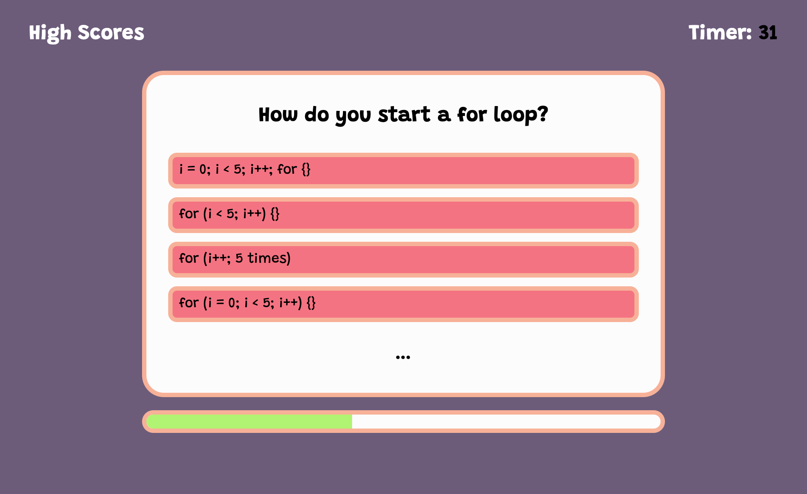
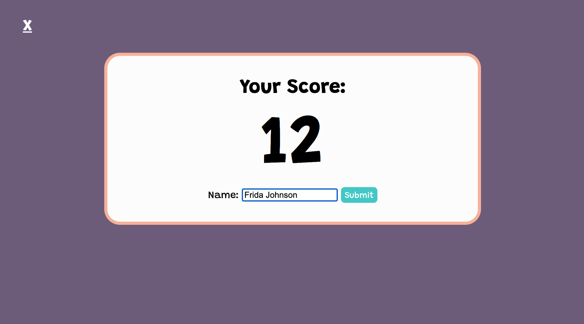
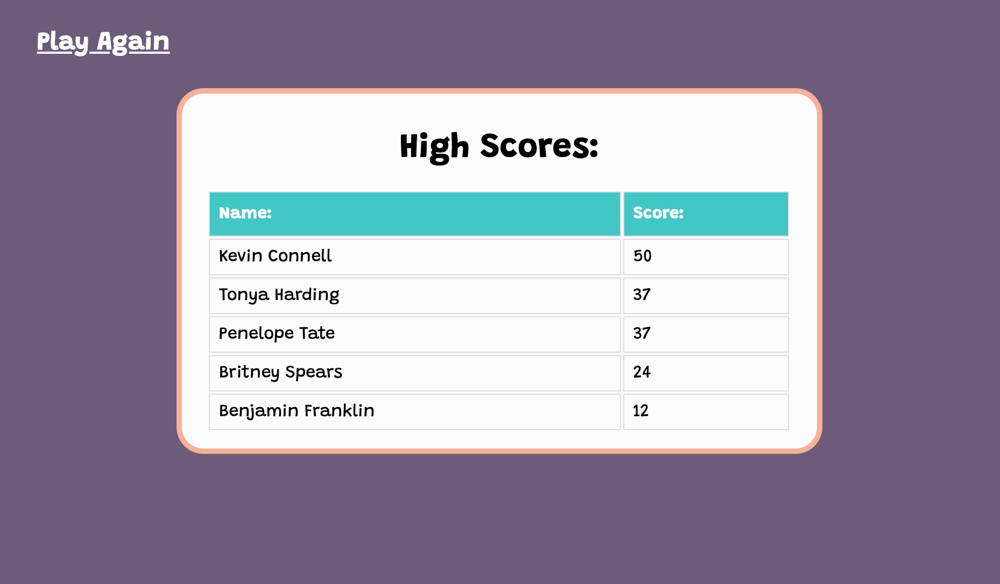

WELCOME TO MY QUIZ

**Please excuse the tardiness. If you look at my git logs, I have had this project done for a while, but forgot to do the last push and submit**

This project showcases my progress with javascript, HTML, and CSS.

My goal: Create a JavaScript quiz using JavaScript fundamentals that locally stores high scores so the user compare progress.

The project is comprised of three sites.

**1. Main Quiz**

This page contains a quiz that when started, pulls questions with randomly ordered answer choices. The timer counts down and correlates with the users score. The quiz determines whether user choices are correct and penalizes wrong answer with a time decrease. A progress bar dynamically animates and displays the user's level of completion. 

**2. Submit Your Score Page**

This page allows the user to record their score with a name. The users score is then compared to a list of scores stored locally to determine high scores.

**3. High Scores**

This page displays an up-to-date list of high scores in order of highest to lowest. All user-related HTML elements is written using JavaScript pulling from local storage.

Deployed Site : https://kevinconnell96.github.io/codeQuiz_KTC/